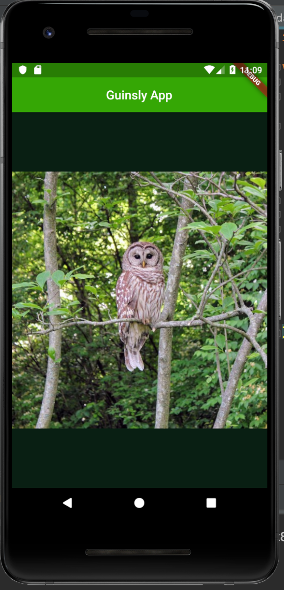

# i_am_rich

A new Flutter application.

## Getting Started

This project is a starting point for a Flutter application.

A few resources to get you started if this is your first Flutter project:

- [Lab: Write your first Flutter app](https://flutter.dev/docs/get-started/codelab)
- [Cookbook: Useful Flutter samples](https://flutter.dev/docs/cookbook)

For help getting started with Flutter, view our
[online documentation](https://flutter.dev/docs), which offers tutorials,
samples, guidance on mobile development, and a full API reference.



```dart
import 'package:flutter/material.dart';

void main() { runApp(
      MaterialApp(
        home: Scaffold(
          backgroundColor: Colors.green[900],
          appBar: AppBar(
            backgroundColor: Color.fromARGB(200, 65, 206, 3),
            title: Center(
              child: Text('Guinsly App'),
            ),
          ),
          body: Center(
            child: Image(
              image: NetworkImage('https://flutter.github.io/assets-for-api-docs/assets/widgets/owl-2.jpg'),
             ),
          ),
          ),
        ),
    );
}

```


